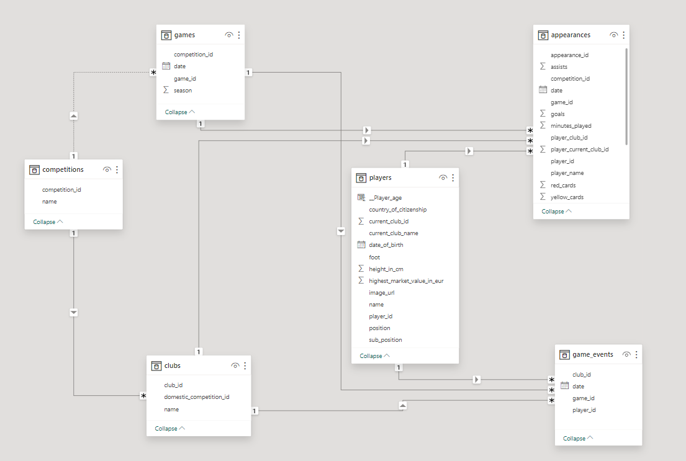
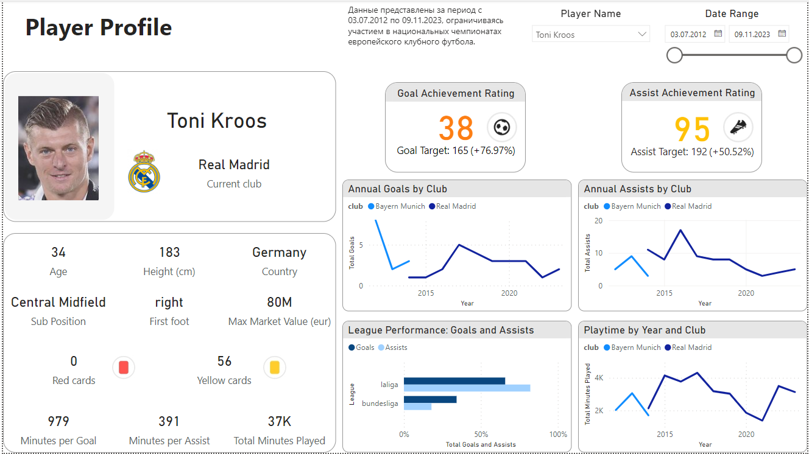

# Профили футбольных игроков

## Введение

Репозиторий "Профили Футбольных Игроков" представляет собой интерактивный дашборд, разработанный в Power BI для визуализации статистики футболистов. Собранные данные охватывают период с 3 июля 2012 года по 9 ноября 2023 года и включают участие игроков в национальных чемпионатах европейского клубного футбола. Дашборд создан с целью предоставить футбольным фанатам удобный доступ к ключевой информации об их любимых игроках, такой как количество забитых голов, голевых передач и других спортивных показателей.

Данные для этого проекта Power BI были взяты с Kaggle. Ознакомиться с исходным набором данных можно по следующей ссылке: [Football Data from Transfermarkt](https://www.kaggle.com/datasets/davidcariboo/player-scores).

## Файлы проекта
- `player_profile.pbix`: Основной файл проекта Power BI, содержащий дашборд и визуализации.
- `data_model.png`: Скриншот модели данных, используемой в дашборде.

- `dashboard_screenshot.png`: Скриншот интерактивного дашборда.

## Структура данных

### Связи между таблицами
- `competitions` и `games` связаны ключом `competition_id`.
- `competitions` и `clubs` связаны ключами `competition_id` из `competitions` и `domestic_competition_id` из `clubs`.
- `games` и `appearances` связаны ключом `game_id`.
- `games` и `game_events` связаны ключом `game_id`.
- `clubs` и `appearances` связаны ключами `club_id` из `clubs` и `player_club_id` из `appearances`.
- `clubs` и `game_events` связаны ключом `club_id`.
- `players` и `appearances` связаны ключом `player_id`.
- `players` и `game_events` связаны ключом `player_id`.

### Описание таблиц
Описание каждой таблицы и их атрибутов представлено ниже.

#### `appearances`
Хранит информацию о выступлениях игроков в играх.

| Название атрибута      | Тип атрибута | Смысловое значение                 |
|------------------------|--------------|------------------------------------|
| appearance_id          | int          | Уникальный идентификатор выступления |
| assists                | int          | Количество голевых передач        |
| competition_id         | int          | Идентификатор соревнования        |
| date                   | date         | Дата проведения игры              |
| game_id                | int          | Идентификатор игры                |
| goals                  | int          | Количество забитых голов          |
| minutes_played         | int          | Количество минут на поле          |
| player_club_id         | int          | Идентификатор клуба игрока        |
| player_current_club_id | int          | Идентификатор текущего клуба игрока |
| player_id              | int          | Уникальный идентификатор игрока    |
| player_name            | text         | Имя игрока                        |
| red_cards              | int          | Количество красных карточек       |
| yellow_cards           | int          | Количество желтых карточек        |

#### `clubs`
Содержит информацию о футбольных клубах.

| Название атрибута          | Тип атрибута | Смысловое значение                 |
|----------------------------|--------------|-------------------------------------|
| club_id                    | int          | Уникальный идентификатор клуба     |
| domestic_competition_id    | int          | Идентификатор внутреннего соревнования, в котором участвует клуб |
| name                       | text         | Название клуба                     |

#### `competitions`
Список футбольных соревнований с уникальными идентификаторами и названиями.

| Название атрибута          | Тип атрибута | Смысловое значение                 |
|----------------------------|--------------|-------------------------------------|
| competition_id             | int          | Уникальный идентификатор соревнования |
| name                       | text         | Название соревнования              |

#### `game_events`
Отражает события, происходящие во время игр, связанные с определенными игроками и клубами.

| Название атрибута          | Тип атрибута | Смысловое значение                 |
|----------------------------|--------------|-------------------------------------|
| club_id                    | int          | Идентификатор клуба                |
| date                       | date         | Дата проведения события            |
| game_id                    | int          | Уникальный идентификатор игры      |
| player_id                  | int          | Уникальный идентификатор игрока    |

#### `games`
Детализирует игры, проведенные в рамках определенных соревнований.

| Название атрибута          | Тип атрибута | Смысловое значение                 |
|----------------------------|--------------|-------------------------------------|
| competition_id             | int          | Уникальный идентификатор соревнования |
| date                       | date         | Дата проведения игры               |
| game_id                    | int          | Уникальный идентификатор игры      |
| season                     | text         | Сезон проведения игры              |

#### `players`
Включает подробные сведения о футболистах.

| Название атрибута          | Тип атрибута | Смысловое значение                 |
|----------------------------|--------------|-------------------------------------|
| player_id                  | int          | Уникальный идентификатор игрока    |
| current_club_id            | int          | Идентификатор текущего клуба игрока |
| country_of_citizenship     | text         | Страна гражданства игрока          |
| date_of_birth              | date         | Дата рождения игрока               |
| foot                       | text         | Доминирующая нога игрока           |
| height_in_cm               | int          | Рост игрока в сантиметрах          |
| highest_market_value_in_eur| decimal      | Самая высокая рыночная стоимость игрока в евро |
| name                       | text         | Имя игрока                        |
| position                   | text         | Игровая позиция игрока             |
| sub_position               | text         | Дополнительная позиция игрока      |

## Визуализации, меры и вычисляемые столбцы

Для дашборда Power BI были созданы специализированные меры и вычисляемый столбец, которые позволяют анализировать данные и выводить ключевые показатели эффективности.

### Определения мер в таблице 'Appearances'

- `Assist_rating` - рейтинг эффективности голевых пасов, сравниваемый с максимальным показателем по позиции. Используется для изменения цвета на KPI-карточке 'Assist Achievement Rating' в зависимости от достигнутого рейтинга.
- `Average_min_of_assist` - среднее количество минут на ассист.
- `Average_min_of_goal` - среднее количество минут на гол.
- `Goal_scoring_rating` - рейтинг эффективности забитых голов, сравниваемый с максимальным показателем по позиции. Используется для изменения цвета на KPI-карточке 'Goal Achievement Rating' в зависимости от достигнутого рейтинга.
- `Max_assists_by_player_same_position` - максимальное количество ассистов игроком, сравниваемое с другими игроками на той же позиции.
- `Max_goals_by_player_same_position` - максимальное количество голов игроком, сравниваемое с другими игроками на той же позиции.
- `Total_assists_by_player` - общее количество ассистов игроком.
- `Total_goals_by_player` - общее количество голов игроком.

### Определение вычисляемого столбца в таблице 'Players'

- `Player_age` - рассчитывается как разница между текущей датой и датой рождения игрока в годах.

### Подсказки для KPI карточек

Для улучшения понимания показателей KPI в дашборде разработаны подсказки, которые предоставляют контекст и дополнительные сведения о производительности игроков:

#### `Goal Achievement Rating`
Классифицирует игроков по эффективности забитых голов по отношению к максимальным показателям для их позиции:
- **Зеленый**: Нападающие, забившие 44% или более от максимального числа голов по позиции.
- **Желтый**: Нападающие со счетом от 33% до 43% от максимума.
- **Оранжевый**: Нападающие со счетом от 11% до 32% от максимума.
- **Красный**: Нападающие с менее чем 11% от максимального числа голов.

Для полузащитников и защитников пороги установлены на уровнях 60%, 30%, и 15% и 48%, 24%, 12% соответственно.

#### `Assist Achievement Rating`
Классифицирует игроков по количеству голевых передач по сравнению с максимальным значением для их позиции:
- **Зеленый**: Нападающие, выполненные ассисты которых составляют 44% или более от максимума по позиции.
- **Желтый**: Нападающие с числом ассистов между 22% и 43% от максимума.
- **Оранжевый**: Нападающие с числом ассистов между 11% и 21% от максимума.
- **Красный**: Нападающие с числом ассистов менее 11% от максимума.

Аналогично, для полузащитников и защитников установлены пороги в 52%, 26% и 10% и 46%, 23%, 11% соответственно.

